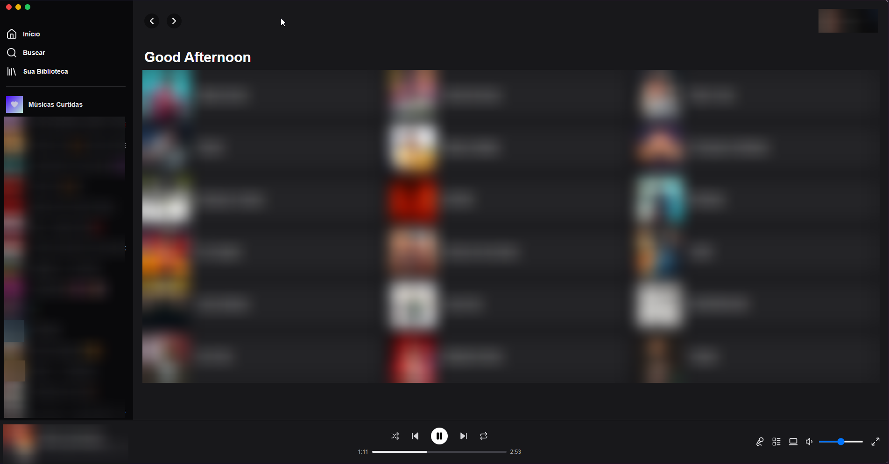

# Spotify Clone

Este é um projeto de estudo desenvolvido para aprender e praticar React, Next.js 15 e a API do Spotify. O objetivo é criar uma aplicação web que simula algumas funcionalidades do Spotify, como exibir playlists, artistas favoritos e controlar a reprodução de músicas.

## Tecnologias Utilizadas

- **React**: Biblioteca JavaScript para construção de interfaces de usuário.
- **Next.js 15**: Framework React para renderização do lado do servidor e geração de sites estáticos.
- **Spotify Web SDK**: Biblioteca para integração com a API do Spotify.
- **Tailwind CSS**: Framework CSS para estilização rápida e responsiva.
- **Lucide React**: Conjunto de ícones para React.
- **clsx**: Utilitário para construção condicional de classes CSS.
- **Tailwind Merge**: Utilitário para mesclar classes Tailwind CSS.
- **TypeScript**: Superset do JavaScript que adiciona tipagem estática.

## Funcionalidades

- Autenticação com o Spotify.
- Exibição de playlists do usuário.
- Exibição de artistas favoritos do usuário.
- Controle de reprodução de músicas (play, pause, skip, repeat).
- Controle de volume.
- Exibição de informações da música atual.

## Instalação e Execução

Siga os passos abaixo para instalar e executar o projeto localmente.

### Pré-requisitos

- Node.js (versão 14 ou superior).
- Conta no Spotify Developer e um aplicativo registrado para obter as credenciais da API.

### Passo a Passo

1. **Clone o repositório**
   ```bash
   git clone https://github.com/JobsonMarinho/estudo-site-musica.git
   cd estudo-site-musica
   ```

2. **Instale as dependências**
   ```bash
   npm install
   ```

3. **Configure as variáveis de ambiente**
   Crie um arquivo `.env.local` na raiz do projeto e adicione as seguintes variáveis:
   ```env
   NEXT_PUBLIC_SPOTIFY_CLIENT_ID=your_spotify_client_id
   NEXT_PUBLIC_SPOTIFY_CLIENT_SECRET=your_spotify_client_secret
   ```

4. **Execute o projeto em modo de desenvolvimento**
   ```bash
   npm run dev
   ```

5. **Acesse a aplicação**
   Abra o navegador e acesse [http://localhost:3000](http://localhost:3000).

## Estrutura do Projeto

A estrutura do projeto está organizada da seguinte forma:

```
/src
  /app
    /components
      - animated-icon.tsx
      - artist-card.tsx
      - content.tsx
      - favorites-content.tsx
      - footer.tsx
      - login-button.tsx
      - playback-item.tsx
      - player-control.tsx
      - sidebar.tsx
      - signout-button.tsx
      - user-card.tsx
    /hooks
      - useSpotify.ts
    /services
      - spotify-api.ts
    /utils
      - tailwind-merge.ts
    - layout.tsx
    - page.tsx
    - spotify-provider.tsx
  /pages
    - callback.tsx
    - favorites.tsx
  - globals.css
/tailwind.config.ts
/package.json
```

## Pacotes Utilizados

- **clsx**: ^2.1.1
- **lucide-react**: ^0.468.0
- **next**: 15.1.1
- **react**: ^19.0.0
- **react-dom**: ^19.0.0
- **spotify-web-sdk**: ^0.7.2
- **tailwind-merge**: ^2.5.5
- **@eslint/eslintrc**: ^3
- **@types/node**: ^20
- **@types/react**: ^19
- **@types/react-dom**: ^19
- **eslint**: ^9
- **eslint-config-next**: 15.1.1
- **postcss**: ^8
- **tailwindcss**: ^3.4.1
- **typescript**: ^5

## Contribuição

Este projeto é apenas para fins de estudo e não está aberto para contribuições externas no momento.

## Licença

Este projeto é licenciado sob a licença MIT. Veja o arquivo LICENSE para mais detalhes.

Desenvolvido por [Jobs](https://github.com/JobsonMarinho/) 🚀

Se você gostou deste projeto, sinta-se à vontade para dar uma estrela ⭐ no repositório!